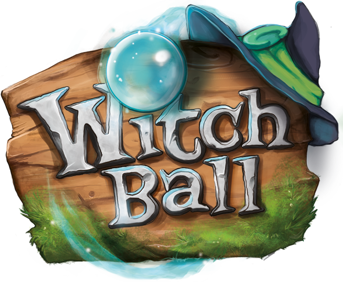

    

## Witch Ball (Student Project)

Witch Ball is a local pvp 2D twin-stick shooter

#### Links

Homepage: http://witchball.school4games.net/
itch.io: https://s4g.itch.io/witch-ball

### Team

  - Karim Steins (Producer) [LinkedIn](https://www.linkedin.com/in/karim-steins-845001103/)
  - Paulina Pabst (Game Design) [LinkedIn](https://de.linkedin.com/in/paulinapabst)
  - Felix Konprecht (Engineer) [LinkedIn](https://www.linkedin.com/in/felix-konprecht-943469181/) | [GitHub](https://github.com/Solek798)
  - Jessy Lee (Artist) [ArtStation](https://www.artstation.com/pixelcr0wn)
  - Ronja Brodocz (Artist) [LinkedIn](https://www.linkedin.com/in/ronja-brodocz-b64b41173/) | [Behance](https://www.behance.net/ronjabrodocz)
  - Katarina Stadler (Artist) [ArtStation](https://www.artstation.com/forestmoth)
  - Mohammad Malandi (Artist) [LinkedIn](https://www.linkedin.com/in/mohammad-malandi-55a78899/)
  - Antonio Waletzki (Artist) [LinkedIn](https://www.linkedin.com/in/antonio-waletzki-b28228174/)
  - Daniel Oppermann (Artist) [Facebook](https://www.facebook.com/daniel.oppermann.75)
  - Jeremy Froböse (Music) [Website](https://www.jeremyfroboese.com/)

### Technical Documentation

  - [Technical Design Document](Docs/Witch-Ball_TDD.pdf)

### How to build

#### Required Engine Version: Godot 3.0.6

  - load the Godot project with the correct Engine version
  - use the Godot build tool to build the project
